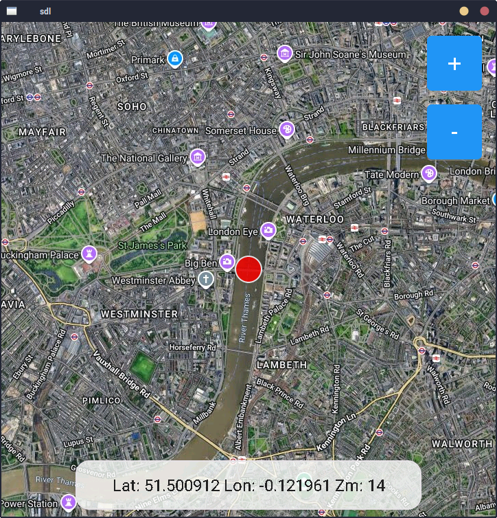

# ESPHome external component for displaying maps

A map tiles component for ESPHome projects using LVGL 8.x. This component provides functionality to load and display map tiles with GPS coordinate conversion, designed for embedded applications requiring map display capabilities.

The component relies on a server that serves map tiles in RGB565 raw pixels data. See server.py



## Installation

This component can be run on esp32 or host using sdl2. Host depends on [IXWebSocket](https://github.com/machinezone/IXWebSocket) library, which must be installed and available to esphome build environment.

## Usage

### Basic Setup

Setup the esptiles component

```yaml
external_components:
- source:
    type: local
    path: ../components

  components: [ esptiles ]

esptiles:
  id: tiles
  url_template: "http://localhost:5000/{z}/{x}/{y}"
```

Setup the LVGL map container
```yaml
widgets:
    - container:
        width: 720
        height: 720
        clip_corner: true
        # scrollable: false
        # clickable: false
        widgets:
            - image:
                id: chart_image
                src: map

            - obj:
                id: position_marker 
                width: 40
                height: 40
                radius: 20 
                bg_color: red
                bg_opa: 80%
                border_width: 2
```

In a lambda function where you have access to latitude and longitude run the following functions. This will set where the map will be rendered, fetch the tiles and show a marker at the lat/lon position. As the lat/lon values change new tiles will be fetched from the server and rendered.

```cpp
float latitude = 51.5009119888814;
float longitude = -0.12196072171167495;

id(tiles)->set_chart_image(id(chart_image));
id(tiles)->update_position(latitude, longitude, id(zoom));
id(tiles)->offset_object_to(id(position_marker), latitude, longitude);
```

Run server.py, it serves map tiles from google satellite in RGB565 format

Run examples/sdl.yaml using esphome run sdl.yaml

## License

This component is released under the MIT License. See LICENSE file for details.

## Contributing

Contributions are welcome! Please feel free to submit pull requests or open issues for bugs and feature requests.

## Support

For questions and support, please open an issue on the GitHub repository.


